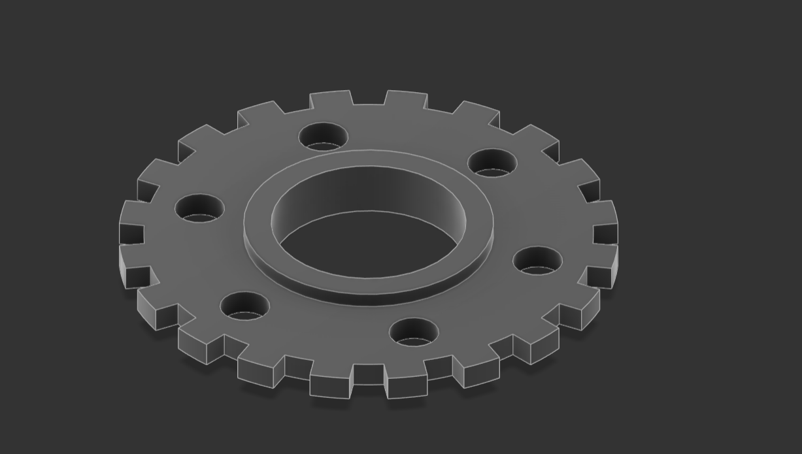
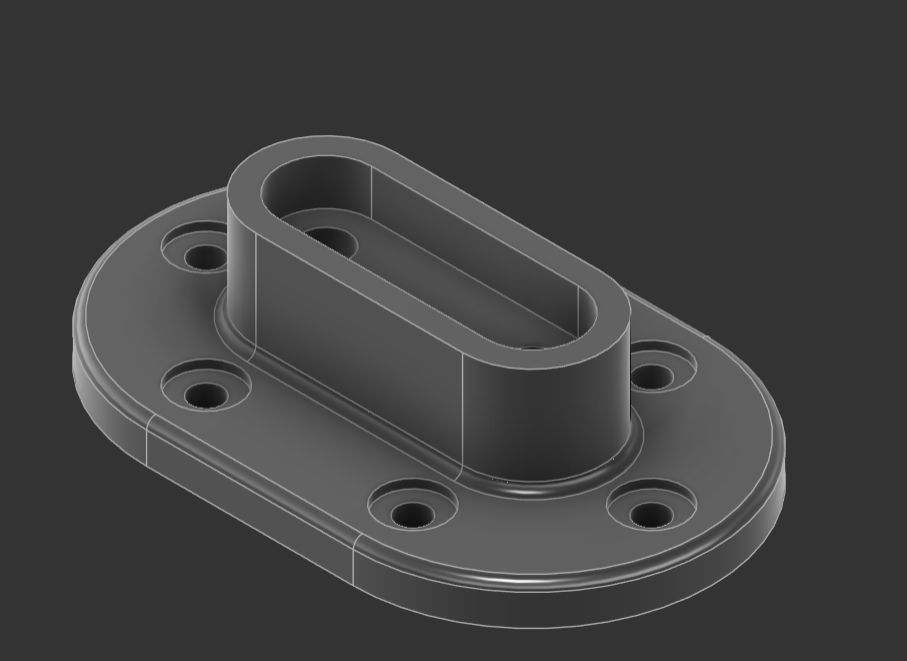
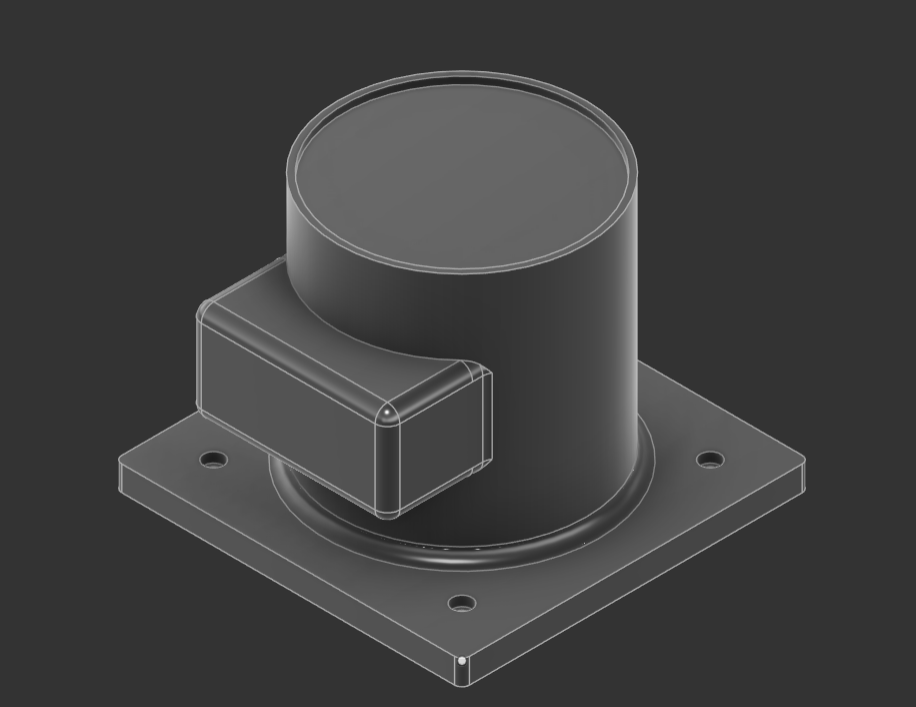
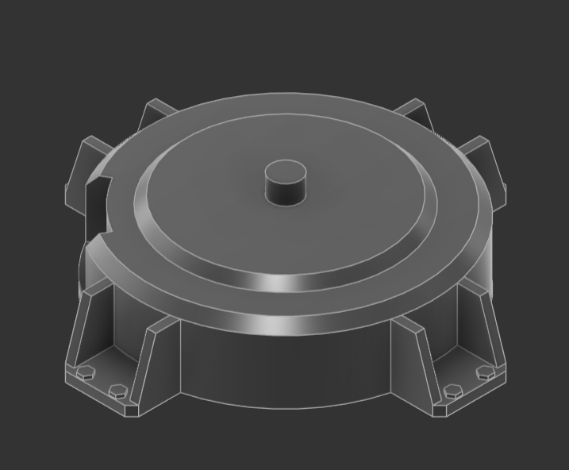
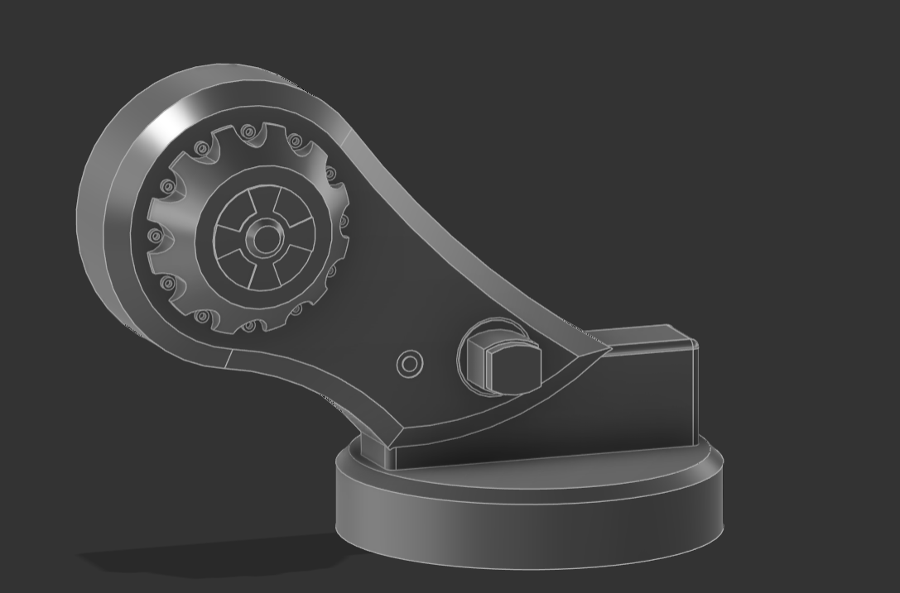

# CAD & Mechanical Design Portfolio

Welcome to my mechatronics design archive. This repository documents my independent engineering projects and digital manufacturing progress.

## Project 1: Industrial Spur Gear (Pinterest Reverse-Engineering Study)

### 📸 Visual Model Presentation

### 📐 Design Logic & Engineering Takeaways
* **Autonomous Modeling:** Reverse-engineered a mechanical transmission spur gear directly from a 2D dimensioned drawing sheet I found on Pinterest without video tutorials.
* **Geometric Construction:** Practiced geometric shape blending and precise circular patterning constraints to align gear teeth and mounting slots symmetrically around a central axis.

## Project 2: Oval Bracket (Pinterest Reverse-Engineering Study)

### 📸 Visual Model Presentation

### 📐 Design Logic & Engineering Takeaways
* Built the slot profile manually by intersecting a central rectangle sketch with two tangent circle halves.
* Sketched holes on the base plate to allow mounting bolt heads.
* Applied the fillet tool to the sharp edges.

## Project 3: Robotic Arm Base (Video-Guided Practice)

### 📸 Visual Model Presentation

### 📐 How I Designed It
* **Video-Guided Layout:** Followed a step-by-step video tutorial to learn how to structure complex industrial parts.
* **Side Motor Mount:** Modeled a rectangular box housing directly onto the side of the main cylinder to act as a holder for a servo motor.
* **Base Holes and Smooth Edges:** Placed four alignment holes on the square base plate and used the fillet tool to create smooth transitions at the structural joints.

## Project 4: 6-Axis Robotic Arm components (Video-Guided Practice)

I am currently working through a 5-video industrial design playlist to model a complete articulated robotic arm. This section serves as a live progress log as I complete and export each individual component before final assembly.

### 📸 Component 1: Main Base 

### 📸 Component 2: Jaw 1

### 📐 Design Logic 
* **Making Parts Fit:** I am sketching new pieces directly on top of my previous parts so that all the holes and faces line up perfectly for the final assembly.
* **Using Pattern Tools:** I am using the circular pattern tool to copy bolt holes and structural support ribs around the cylinders to save time and keep things perfectly symmetric.
